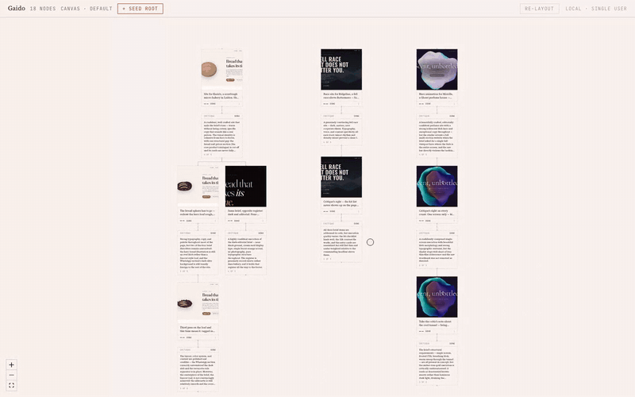
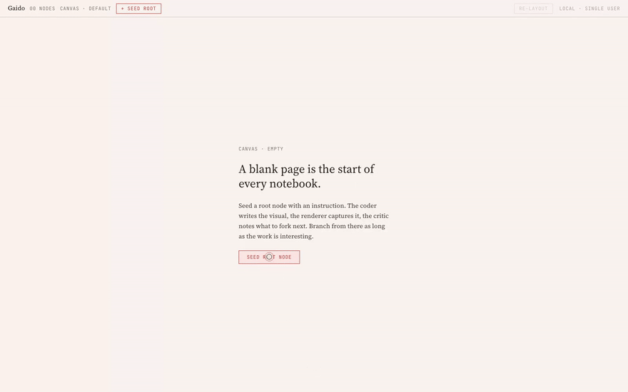
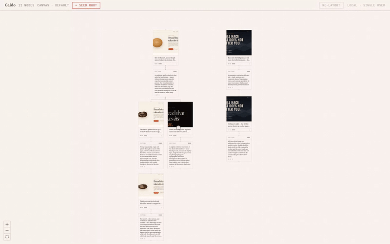
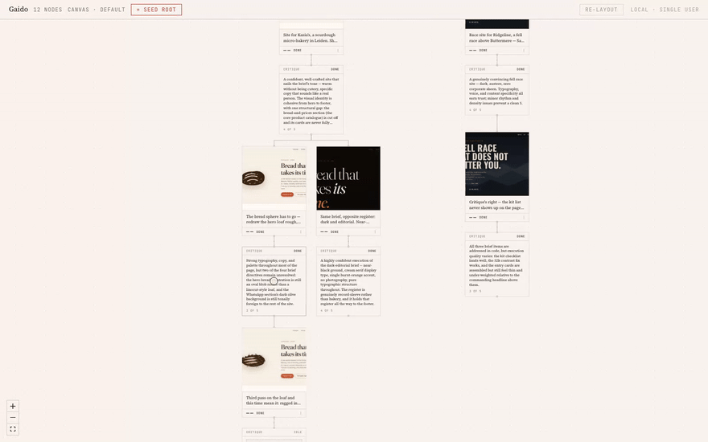
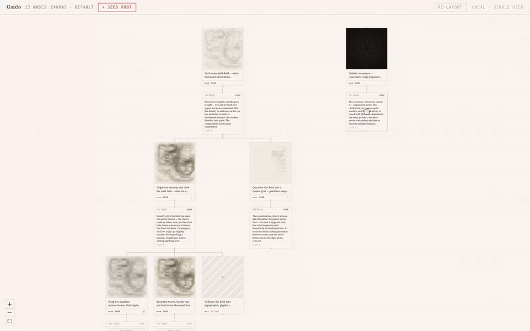

# gaido

**A lab notebook for creative-coding agents.** Type a brief; a coder agent
builds it — a website, a Pixi scene, a canvas experiment — a renderer films
the result, a critic reviews it. Every attempt is a node on a graph you can
fork.

Local-first: your filesystem, your git, your keys.

[gaido.ai](https://gaido.ai) · [Quickstart](#quickstart) · [How it's built](#how-its-built)



*One client brief — "a slow glass blob, iridescent like oil on water" —
pushed through three takes in one branch. The critic called take one pastel
and take two a cool tunnel; take three got its amber sweep. Then the actual
`index.html` from the third node's git worktree, opened. The video in the
card and the file on disk are the same thing.*

## The loop



One instruction in, one rendered variation out. The coder works in its own
git worktree; the renderer drives headless Chromium on a fixed clock, so a
scene renders the same way twice. When the run finishes, a critique slot
opens under it.

## Fork, don't undo



A node is a slot; runs are attempts to fill it. Fork from any point — a fork
is a git branch, so siblings are cheap and nothing is overwritten. Above: one
bakery brief pushed through three passes in a single branch (the critic kept
rejecting the hero loaf), a dark A/B sibling, and a second client on the same
canvas. Failed branches stay too. They're part of the experiment.

## A critic in the loop



A critic agent — or you; reviewing every render yourself is a first-class
mode — judges each run against its brief: a rating, concrete weaknesses,
proposed rules. When feedback should outlive one branch, promote it: the rule
lands in `LESSONS.md`, plain markdown at the project root, and every fresh
session starts from it. The fork above read *"smooth vector shapes are not a
substitute for hand-drawn assets"* before it redrew the loaf.

## Switch coders mid-graph



Coders are adapters — Claude Code, Codex, OpenCode, and Cursor ship in the
box. Run several inside one exploration, switch under any critique, and the new
coder continues from the same committed code — resuming the session where the
adapter allows it, resetting cleanly where it doesn't.

## Quickstart

```sh
mkdir drift-studies && cd drift-studies
npx gaido init
npx playwright install chromium   # one-time: the renderer's browser
npx gaido
```

Opens the graph at `127.0.0.1:4288`, pointed at the current directory. The
init template runs end-to-end on stub adapters; wire real ones in
`gaido.config.ts`:

```ts
import {
  defineConfig,
  claudeCodeCoder,
  codexCoder,
  opencodeCoder,
  cursorCoder,
  geminiCritic,
  playwrightRenderer,
} from 'gaido';

export default defineConfig({
  coders: {
    'cc-sonnet': claudeCodeCoder({ model: 'sonnet' }),
    'cc-opus': claudeCodeCoder({ model: 'opus' }),
    codex: codexCoder({ effort: 'medium' }),
    // OpenCode reaches any provider it's configured for; this hosted one is free, no key.
    opencode: opencodeCoder({ model: 'opencode/deepseek-v4-flash-free' }),
    // Cursor CLI; effort is part of the model id (`cursor-agent models` lists them).
    cursor: cursorCoder({ model: 'auto' }),
  },
  critic: geminiCritic(), // or humanCritic() — your eye, no API
  renderer: playwrightRenderer(),
  render: { width: 1024, height: 1024, fps: 30, duration: 5 },
});
```

Requires Node 20+ and `ffmpeg`. The bundled coder adapters shell out to the
`claude` / `codex` / `opencode` / `cursor-agent` CLIs — your existing
subscriptions and logins, no extra keys.

## How it's built

- **The graph is the workflow.** No workflow engine — SQLite, a state
  machine, and an events table. Nodes alternate coder → critique, with
  config nodes marking mid-graph switches.
- **Versioning is git.** Each coder node owns a worktree and a branch backed
  by one bare repo. Fork = `git worktree add` off the parent's tip. Retry
  stacks a commit. Diffs and reverts come free.
- **Renders are reproducible.** Headless Chromium with a faked clock steps
  through frames; ffmpeg encodes. Same code, same video. Websites get a
  scroll-through capture — the camera pans the page, slower when the page
  is tall, so the critic sees every section.
- **Adapters are the only pluggable surface.** Coder, critic, renderer —
  three interfaces in `@vadimlobanov/gaido-core`. Everything else is deliberately
  hardcoded.
- **Skeletons seed roots.** Named starting points (`skeletons/<name>/`) per
  root node, so sibling roots can A/B different starting contexts. Init ships
  three — `default` (Pixi), `css`, and `website`, whose config overlay swaps
  in the scroll renderer and a web-designer critic for that lineage only.
- **References feed the coder.** Attach images or other runs to any node;
  they're materialized into the worktree, excluded from the art's diff.

## Status

Early and moving. Local-first, single-user by design. Built in the open —
the graph model is settling, the adapter interfaces are nearly stable.

MIT © Vadim Lobanov
